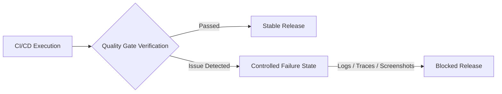

# Bruno Fulia - QA Engineer

## ISTQB Certified | Web · Mobile · API · AI Platform Validation

QA Engineer focused on validating complex software ecosystems across Web, Mobile, APIs, and AI-powered platforms.

With a background combining Web Development and Business Law, I approach Quality Assurance from two perspectives: software reliability and risk-based analysis. I design automation frameworks, quality gates, and testing strategies that help teams detect functional, security, and compliance risks before production.

My focus is building practical QA solutions that connect engineering practices with real-world product requirements, including accessibility, API reliability, security validation, and AI system behavior.

---

## 📑 Table of Contents

- [Technical Ecosystem](#️-technical-ecosystem)
- [Featured Quality & Automation Frameworks](#-featured-quality--automation-frameworks)
  - [1. Web Compliance & Accessibility QA Framework](#-1-web-compliance--accessibility-qa-framework)
  - [2. API & Data Privacy Contract Testing Framework](#-2-api--data-privacy-contract-testing-framework)
  - [3. LLM Quality & Security Framework](#-3-llm-quality--security-framework)
  - [4. AI - Auto Ignite · Plug & Work AI Context Kit](#️-4-ai---auto-ignite--plug--work-ai-context-kit)
- [Professional Connection](#-professional-connection)

---

## 🛠️ Technical Ecosystem

| Domain | Core Technologies, Libraries & Environments |
| --- | --- |
| **Test Automation** | Playwright, Robot Framework, Selenium WebDriver, Cucumber (BDD) |
| **API & Backend Validation** | Postman, Insomnia, Bruno, Karate DSL, SQL |
| **Mobile Testing** | Appium, Android Debug Bridge (ADB), Scrcpy, Logcat |
| **AI Tooling & Governance** | Python, Promptfoo, Garak, PyTest, Markdown |
| **Languages & Scripting** | TypeScript, Python, JavaScript, Java, PHP, HTML, CSS |
| **CI/CD & DevOps** | GitHub Actions, Docker, VirtualBox, Linux Shell |
| **Quality Management** | Jira, Xray, Confluence, Notion, ClickUp, Obsidian |

---

## 📂 Featured Quality & Automation Frameworks

My portfolio focuses on **controlled failure validation**: frameworks designed not only to verify expected behavior, but also to detect, capture, and report critical deviations through explicit quality gates.

Each project demonstrates how automated testing can transform failures into actionable engineering signals through logs, traces, screenshots, and diagnostic artifacts.

### 📄 1. Web Compliance & Accessibility QA Framework

Automated regression framework focused on validating user interfaces, accessibility requirements, and browser-level behaviors.

- **Stack:**    
- **Architecture:** Page Object Model with reusable components, custom fixtures, and separation between test logic, UI models, and validation layers.
- **Technical Scope:** WCAG 2.1 accessibility validation, browser context handling, and regression coverage for complex web applications.
- **Controlled Failure Validation:** Executes invalid scenarios to confirm that quality gates detect regressions, capturing traces, screenshots, network activity, and DOM information.

🔗 **Repository:** [View Project](https://github.com/brunofulia/Web_Compliance_And_Accessibility#readme)

---

### 📦 2. API & Data Privacy Contract Testing Framework

Backend validation framework focused on API contracts, data exposure prevention, and authorization rules to enforce GDPR compliance and RBAC verification.

- **Stack:**   
- **Architecture:** Modular API request layer using the API Object Model pattern, native Playwright HTTP abstractions, and dependency injection via fixtures.
- **Technical Scope:** Response schema validation, sensitive data exposure checks, RBAC authorization testing, and privacy-oriented API validation.
- **Controlled Failure Validation:** Simulates unauthorized access scenarios and blocks execution when protected endpoints behave unexpectedly.

🔗 **Repository:** [View Project](https://github.com/brunofulia/API_Data_Privacy_Contract_Testing#readme)

---

### 🤖 3. LLM Quality & Security Framework

Enterprise-grade validation framework focused on evaluating AI behavior, prompt robustness, safety boundaries, and compliance with the EU AI Act & OWASP Top 10 for LLMs.

- **Stack:**     
- **Architecture:** Provider-independent testing layer with a decoupled Mock LLM Adapter, custom schema evaluators, and JSON-based adversarial datasets.
- **Technical Scope:** Prompt injection testing, jailbreak evaluation, response safety checks, contract breaches, and hallucination detection.
- **Controlled Failure Validation:** Enforces strict KO states (security leaks, invalid schema, hallucinations) that break the build if CI/CD fails to block threats.

🔗 **Repository:** [View Project](https://github.com/brunofulia/LLM_Quality_And_Security_Framework#readme)

---

### ⚙️ 4. AI - Auto Ignite · Plug & Work AI Context Kit

A portable governance, memory, and hierarchical consistency system for projects assisted by Artificial Intelligence (LLMs).

- **Stack:**   
- **Architecture:** 100% plain text (Markdown) coupled with native Python scripts for deterministic automation (no external dependencies, DBs, or plugins).
- **Technical Scope:** Multi-layered memory system (Active, Volatile, Historical), rigid authority hierarchy mapping (`HIERARCHY.md`), and automated ritual validation scripts.
- **Controlled Governance:** Reduces LLM context token usage by >90% through dynamic indexing, blocks structural violations with hard guardrails (Exit Code != 0), and ensures semantic consistency across AI sessions.

🔗 **Repository:** [View Project](https://github.com/brunofulia/AutoIgnite_Plug_and_Work_AI_Context_Kit#readme)

---

## 👥 Professional Connection

- Email: [brunofulia@gmail.com](mailto:brunofulia@gmail.com)
- LinkedIn: https://www.linkedin.com/in/bruno-fulia/

