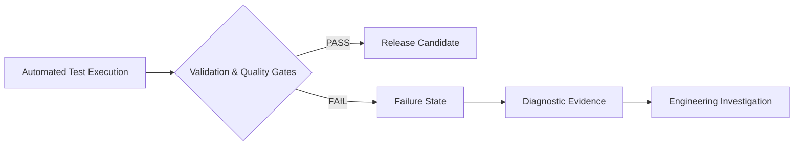

# Bruno Fulia - QA Engineer

## ISTQB Certified | Web · Mobile · API · AI & LLM Validation

QA Engineer focused on validating Web, Mobile, API, and AI-powered software systems. I design automation frameworks and quality gates that go beyond expected-behavior validation by detecting, capturing, and surfacing critical deviations before release.

Previously validated AI platform behavior at Samsung Electronics across Galaxy AI, Bixby, and SmartThings. My background in Business Law adds a risk-based perspective to compliance-oriented testing, data privacy, and regulatory-aware QA.

---

## 📑 Table of Contents

- [Technical Ecosystem](#️-technical-ecosystem)
- [Quality & Validation Frameworks](#-quality--validation-frameworks)
  - [Web Compliance & Accessibility QA Framework](#-web-compliance--accessibility-qa-framework)
  - [REST API Testing Showcase (Bruno + Postman + Newman)](#-rest-api-testing-showcase-bruno--postman--newman)
  - [API Security & Data Privacy QA Framework](#-api-security--data-privacy-qa-framework)
  - [Role-Based Access Control (RBAC) Security Gate](https://github.com/brunofulia/Portfolio#-role-based-access-control-rbac-security-gate)
  - [BDD Cucumber.js Showcase](#-bdd-cucumberjs-showcase)
  - [LLM Quality & Security Validation Framework](#-llm-quality--security-validation-framework)
- [Quality Governance & Engineering Standards](#️-quality-governance--engineering-standards)
  - [QA Engineering Handbook](#-qa-engineering-handbook)
- [AI-Augmented Workflows & Knowledge Systems](#-ai-augmented-workflows--knowledge-systems)
  - [AI - Auto Ignite · Plug & Work AI Context Kit](#️-ai---auto-ignite--plug--work-ai-context-kit)
- [Professional Connection](#-professional-connection)

---

## 🛠️ Technical Ecosystem

| Domain | Core Technologies, Libraries & Environments |
| --- | --- |
| **Test Automation** | Playwright, Robot Framework, Selenium WebDriver, Cucumber (BDD) |
| **API & Backend Validation** | Postman, Insomnia, Bruno, Karate DSL, SQL |
| **Mobile Testing** | Appium, Android Debug Bridge (ADB), Scrcpy, Logcat |
| **AI Tooling & Governance** | Python, Promptfoo, Garak, PyTest, Markdown |
| **Languages & Scripting** | TypeScript, Python, JavaScript, Java, PHP, HTML, CSS |
| **CI/CD & DevOps** | Git, GitHub Actions, Docker, WSL2, Linux Shell |
| **Quality Management** | Jira, Xray, Confluence, Obsidian |

---

## 📂 Quality & Validation Frameworks

My portfolio focuses on **explicit failure detection and diagnostic evidence**: frameworks designed not only to verify expected behavior, but also to detect, capture, and report critical deviations through automated quality gates.

Each project demonstrates how automated testing can transform failures into actionable engineering signals through logs, traces, screenshots, and diagnostic artifacts.

### 📄 Web Compliance & Accessibility QA Framework

Automated QA framework focused on functional UI validation, accessibility auditing, and browser-level behavior testing.

- **Stack:**     
- **Architecture:** Page Object Model with reusable page objects, custom fixtures, and separation between test specifications and UI interaction logic.
- **Technical Scope:** WCAG 2.0/2.1 automated accessibility auditing, browser dialog handling, environment-driven configuration, and Playwright-based UI validation.
- **Test Evidence:** Captures execution traces, screenshots, and diagnostic information on failure to support root-cause analysis.

🔗 **Repository:** [View Project](https://github.com/brunofulia/Web_Compliance_And_Accessibility#readme)

---

### 🚀 REST API Testing Showcase (Bruno + Postman + Newman)

QA Automation portfolio project demonstrating equivalent REST API validation implemented with **Bruno** and **Postman/Newman**, using the same API scenarios, environment configuration, assertions, and automated CLI execution.

- **Stack:**     
- **Architecture:** Layered architecture separating environment configuration, collection definitions, execution engines, target API, and test results.
- **Technical Scope:** HTTP status validation, response data integrity, JSON response structure validation, environment-driven configuration, and CLI-based test execution.
- **Dual-Tool Validation:** The same REST API behavior is validated through two independent testing ecosystems, enabling a direct comparison of their collection formats and execution workflows.

🔗 **Repository:** [View Project](https://github.com/brunofulia/REST_API_Showcase_Bruno_Postman#readme)

---

### 📦 API Security & Data Privacy QA Framework

QA Automation portfolio project demonstrating API-level privacy, authorization, and data contract validation with **Playwright and TypeScript**, including PII exposure detection, data-boundary assertions, environment-driven configuration, and controlled security failure scenarios designed to verify CI/CD quality gates.

- **Stack:**    
- **Architecture:** API Client pattern with custom Playwright fixtures, dedicated validation utilities, environment profiles, and automated execution reporting.
- **Technical Scope:** PII handling validation, authorization testing, API response assertions, synthetic test data, and controlled KO-state execution.
- **Security Validation:** Simulated regression mode intentionally inverts the expected authorization assertion to demonstrate how an access-control regression would fail the automated quality gate.

🔗 **Repository:** [View Project](https://github.com/brunofulia/API_Data_Privacy_Contract_Testing#readme)

---

### 🛡️ Role-Based Access Control (RBAC) Security Gate

Policy-driven security regression framework validating **RBAC authorization and restricted data exposure across API and UI layers** using Robot Framework, Playwright, and RequestsLibrary.

- **Stack:**   -2EAD33?style=flat-square&logo=playwright&logoColor=white)  
- **Architecture:** Policy-as-Data authorization matrix, Discovery-First test contract, separated authentication/authorization layers, and shared data-exposure assertions across API and UI.
- **Technical Scope:** Role/resource/action authorization validation, `401/403/200` authorization response validation, sensitive-field exposure checks, DOM-level access control validation, and business-level authorization policies decoupled from technical endpoints.
- **Security Gate:** Includes a deterministic mock environment and a controlled authorization regression that intentionally exposes restricted data, demonstrating how a CI/CD quality gate detects the violation and blocks subsequent deployment stages.

🔗 **Repository:** [View Project](https://github.com/brunofulia/Role_Based_Access_Control#readme)

---

### 🥒 BDD Cucumber.js Showcase

Executable specification framework connecting functional business criteria in Gherkin with modern automated validations, demonstrating BDD best practices over REST APIs.

- **Stack:**     
- **Architecture:** Clear layer separation between Specification (Gherkin Features), Automation Steps (Cucumber.js), and HTTP Transport Layer using native Node.js 18+ `fetch` alongside `@playwright/test` `expect` assertions.
- **Technical Scope:** Behavior-Driven Development (BDD), data-driven testing via Scenario Outlines, native Node.js `fetch` API validation, lifecycle hooks for diagnostic logging, and native HTML execution reporting.
- **Controlled Failure & Boundary Verification:** Includes deliberate negative scenarios, such as HTTP 404 responses, to verify assertion behavior, diagnostic logging, and failure reporting.

🔗 **Repository:** [View Project](https://github.com/brunofulia/BDD_Cucumber_Showcase#readme)

---

### 🤖 LLM Quality & Security Validation Framework

QA Automation portfolio project demonstrating deterministic security, structural, and behavioral validation for LLM applications using **Python, PyTest, Promptfoo, and Garak**.

- **Stack:**      
- **Architecture:** Decoupled LLM provider adapters, deterministic mock scenarios, dedicated evaluators, adversarial probes, and CI/CD quality gates.
- **Technical Scope:** Prompt injection testing, sensitive-information disclosure checks, structured-output validation, system-prompt leakage detection, and misinformation/unsupported-claim validation.
- **Controlled Failure Testing:** Simulated security leaks, malformed outputs, and hallucination scenarios deliberately trigger pipeline failures to verify that quality gates are fail-safe.

🔗 **Repository:** [View Project](https://github.com/brunofulia/LLM_Quality_And_Security_Framework#readme)

---

## 🏛️ Quality Governance & Engineering Standards

My portfolio extends beyond technical automation into the strategic governance that makes quality scalable across the software lifecycle.

### 📚 QA Engineering Handbook

A structured QA engineering reference designed to document reusable quality models, testing strategies, metrics, and governance practices.

- **Stack:**    
- **Architecture:** Modular repository structure consisting of 12 technical reference domains and a centralized catalog of reusable engineering artifacts.
- **Technical Scope:** 12-chapter engineering reference covering RAG/LLM system evaluation (Faithfulness, Answer Relevance, OWASP LLM Top 10), risk-based test strategy, quantitative QA metrics with formal thresholds (DRE, Defect Leakage Rate, CFR), and a Release Advisory Framework (GO / NO-GO criteria). All standards expressed in RFC 2119 normative language with reusable parameterized templates.
- **Controlled Governance:** Enforces rigorous RFC specification language, invariant parameterized templates, and shift-left CI/CD alignment for quality scaling.

🔗 **Repository:** [View Project](https://github.com/brunofulia/QA_Handbook/blob/main/README.md)

---

## 🧠 AI-Augmented Workflows & Knowledge Systems

My approach to knowledge management and workflow augmentation focuses on structuring context deterministically so that AI models operate within rigid, predictable environments.

### ⚙️ AI - Auto Ignite · Plug & Work AI Context Kit

A portable governance, memory, and hierarchical consistency system for projects assisted by Artificial Intelligence (LLMs).

- **Stack:**  
- **Architecture:** Markdown-based knowledge structure with native Python automation scripts, without external databases or plugins.
- **Technical Scope:** Multi-layered memory system (Active, Volatile, Historical), rigid authority hierarchy mapping (`HIERARCHY.md`), and automated ritual validation scripts.
- **Controlled Governance:** Reduces unnecessary context loading through dynamic indexing, blocks structural violations with hard guardrails (Exit Code != 0), and maintains semantic consistency across AI-assisted sessions.

🔗 **Repository:** [View Project](https://github.com/brunofulia/AutoIgnite_Plug_and_Work_AI_Context_Kit#readme)

---

## 👥 Professional Connection

- Email: [brunofulia@gmail.com](mailto:brunofulia@gmail.com)
- LinkedIn: https://www.linkedin.com/in/bruno-fulia/

