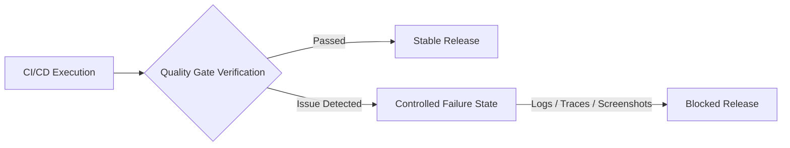

# Bruno Fulia - QA Engineer

## ISTQB Certified | Web · Mobile · API · AI Platform Validation

QA Engineer focused on validating complex software ecosystems across Web, Mobile, APIs, and AI-powered platforms. I design automation frameworks and quality gates that don't just verify expected behavior — they actively detect, capture, and escalate critical deviations before they reach production.

Previously validated AI platform behavior at Samsung Electronics (Galaxy AI, Bixby, SmartThings). My background in Business Law adds a risk-based lens to compliance testing, data privacy validation, and regulatory alignment (GDPR, EU AI Act).

---

## 📑 Table of Contents

- [Technical Ecosystem](#️-technical-ecosystem)
- [Quality & Validation Frameworks](#-quality--validation-frameworks)
  - [Web Compliance & Accessibility QA Framework](#-web-compliance--accessibility-qa-framework)
  - [API & Data Privacy Contract Testing Framework](#-api--data-privacy-contract-testing-framework)
  - [LLM Quality & Security Framework](#-llm-quality--security-framework)
  - [BDD Cucumber.js Showcase](#-bdd-cucumberjs-showcase)
  - [REST API Testing Showcase (Bruno + Postman + Newman)](#-rest-api-testing-showcase-bruno--postman--newman)
- [Quality Governance & Engineering Standards](#️-quality-governance--engineering-standards)
  - [QA Engineering Handbook](#-qa-engineering-handbook)
- [AI-Augmented Workflows & Knowledge Systems](#-ai-augmented-workflows--knowledge-systems)
  - [AI - Auto Ignite · Plug & Work AI Context Kit](#️-ai---auto-ignite--plug--work-ai-context-kit)
- [Professional Connection](#-professional-connection)

---

## 🛠️ Technical Ecosystem

| Domain | Core Technologies, Libraries & Environments |
| --- | --- |
| **Test Automation** | Playwright, Robot Framework, Selenium WebDriver, Cucumber (BDD) |
| **API & Backend Validation** | Postman, Insomnia, Bruno, Karate DSL, SQL |
| **Mobile Testing** | Appium, Android Debug Bridge (ADB), Scrcpy, Logcat |
| **AI Tooling & Governance** | Python, Promptfoo, Garak, PyTest, Markdown |
| **Languages & Scripting** | TypeScript, Python, JavaScript, Java, PHP, HTML, CSS |
| **CI/CD & DevOps** | GitHub Actions, Docker, VirtualBox, Linux Shell |
| **Quality Management** | Jira, Xray, Confluence, Notion, ClickUp, Obsidian |

---

## 📂 Quality & Validation Frameworks

My portfolio focuses on **controlled failure validation**: frameworks designed not only to verify expected behavior, but also to detect, capture, and report critical deviations through explicit quality gates.

Each project demonstrates how automated testing can transform failures into actionable engineering signals through logs, traces, screenshots, and diagnostic artifacts.

### 📄 Web Compliance & Accessibility QA Framework

Automated regression framework focused on validating user interfaces, accessibility requirements, and browser-level behaviors.

- **Stack:**    
- **Architecture:** Page Object Model with reusable components, custom fixtures, and separation between test logic, UI models, and validation layers.
- **Technical Scope:** WCAG 2.1 accessibility validation, browser context handling, and regression coverage for complex web applications.
- **Controlled Failure Validation:** Executes invalid scenarios to confirm that quality gates detect regressions, capturing traces, screenshots, network activity, and DOM information.

🔗 **Repository:** [View Project](https://github.com/brunofulia/Web_Compliance_And_Accessibility#readme)

---

### 📦 API & Data Privacy Contract Testing Framework

Backend validation framework focused on API contracts, data exposure prevention, and authorization rules to enforce GDPR compliance and RBAC verification.

- **Stack:**   
- **Architecture:** Modular API request layer using the API Object Model pattern, native Playwright HTTP abstractions, and dependency injection via fixtures.
- **Technical Scope:** Response schema validation, sensitive data exposure checks, RBAC authorization testing, and privacy-oriented API validation.
- **Controlled Failure Validation:** Simulates unauthorized access scenarios and blocks execution when protected endpoints behave unexpectedly.

🔗 **Repository:** [View Project](https://github.com/brunofulia/API_Data_Privacy_Contract_Testing#readme)

---

### 🤖 LLM Quality & Security Framework

Enterprise-grade validation framework focused on evaluating AI behavior, prompt robustness, safety boundaries, and compliance with the EU AI Act & OWASP Top 10 for LLMs.

- **Stack:**     
- **Architecture:** Provider-independent testing layer with a decoupled Mock LLM Adapter, custom schema evaluators, and JSON-based adversarial datasets.
- **Technical Scope:** Prompt injection testing, jailbreak evaluation, response safety checks, contract breaches, and hallucination detection.
- **Controlled Failure Validation:** Enforces strict KO states (security leaks, invalid schema, hallucinations) that break the build if CI/CD fails to block threats.

🔗 **Repository:** [View Project](https://github.com/brunofulia/LLM_Quality_And_Security_Framework#readme)

---

### 🥒 BDD Cucumber.js Showcase

Executable specification framework connecting functional business criteria in Gherkin with modern automated validations, demonstrating BDD best practices over REST APIs.

* **Tech Stack:**    
* **Architecture:** Clear layer separation between Specification (Gherkin Features), Automation Steps (Cucumber.js), and HTTP Transport Layer using native Node.js 18+ `fetch` alongside `@playwright/test` `expect` assertions.
* **Technical Scope:** Behavior-Driven Development (BDD), Data-Driven Testing via Scenario Outlines, HTTP client-less API validation, lifecycle hooks diagnostic logging, and native HTML execution reporting.
* **Controlled Failure & Boundary Verification:** Features dedicated failure scenarios (e.g., HTTP 404 non-existent user retrieval) to prove pipeline resilience, KO diagnostic logging, and rich report generation upon assertion failure.

🔗 **Repository:** [View Project](https://github.com/brunofulia/BDD_Cucumber_Showcase#readme)

---

### 🚀 REST API Testing Showcase (Bruno + Postman + Newman)

QA Automation portfolio project demonstrating equivalent REST API validation implemented with **Bruno** and **Postman/Newman**, using the same API scenarios, environment configuration, assertions, and automated CLI execution.

- **Stack:**    
- **Architecture:** Layered architecture separating environment configuration, collection definitions, execution engines, target API, and test results.
- **Technical Scope:** HTTP status validation, response data integrity, JSON response structure validation, environment-driven configuration, and CLI-based test execution.
- **Dual-Tool Validation:** The same REST API behavior is validated through two independent testing ecosystems, enabling a direct comparison of their collection formats and execution workflows.

🔗 **Repository:** [View Project](https://github.com/brunofulia/REST_API_Showcase_Bruno_Postman#readme)

---

## 🏛️ Quality Governance & Engineering Standards

My portfolio extends beyond technical automation into the strategic governance that makes quality scalable across the software lifecycle.

### 📚 QA Engineering Handbook

The technical reference specification for institutional quality engineering models, designed to serve as a reusable operational and governance framework.

- **Stack:**  
- **Architecture:** Modular repository structure consisting of 12 technical reference domains and a centralized catalog of executable engineering artifacts.
- **Technical Scope:** 12-chapter engineering reference covering RAG/LLM system evaluation (Faithfulness, Answer Relevance, OWASP LLM Top 10), risk-based test strategy, quantitative QA metrics with formal thresholds (DRE, Defect Leakage Rate, CFR), and a Release Advisory Framework (GO / NO-GO criteria). All standards expressed in RFC 2119 normative language with reusable parameterized templates.
- **Controlled Governance:** Enforces rigorous RFC specification language, invariant parameterized templates, and shift-left CI/CD alignment for quality scaling.

🔗 **Repository:** [View Project](https://github.com/brunofulia/QA_Handbook/blob/main/README.md)

---

## 🧠 AI-Augmented Workflows & Knowledge Systems

My approach to knowledge management and workflow augmentation focuses on structuring context deterministically so that AI models operate within rigid, predictable environments.

### ⚙️ AI - Auto Ignite · Plug & Work AI Context Kit

A portable governance, memory, and hierarchical consistency system for projects assisted by Artificial Intelligence (LLMs).

- **Stack:**   
- **Architecture:** 100% plain text (Markdown) coupled with native Python scripts for deterministic automation (no external dependencies, DBs, or plugins).
- **Technical Scope:** Multi-layered memory system (Active, Volatile, Historical), rigid authority hierarchy mapping (`HIERARCHY.md`), and automated ritual validation scripts.
- **Controlled Governance:** Reduces LLM context token usage by >90% through dynamic indexing, blocks structural violations with hard guardrails (Exit Code != 0), and ensures semantic consistency across AI sessions.

🔗 **Repository:** [View Project](https://github.com/brunofulia/AutoIgnite_Plug_and_Work_AI_Context_Kit#readme)

---

## 👥 Professional Connection

- Email: [brunofulia@gmail.com](mailto:brunofulia@gmail.com)
- LinkedIn: https://www.linkedin.com/in/bruno-fulia/

